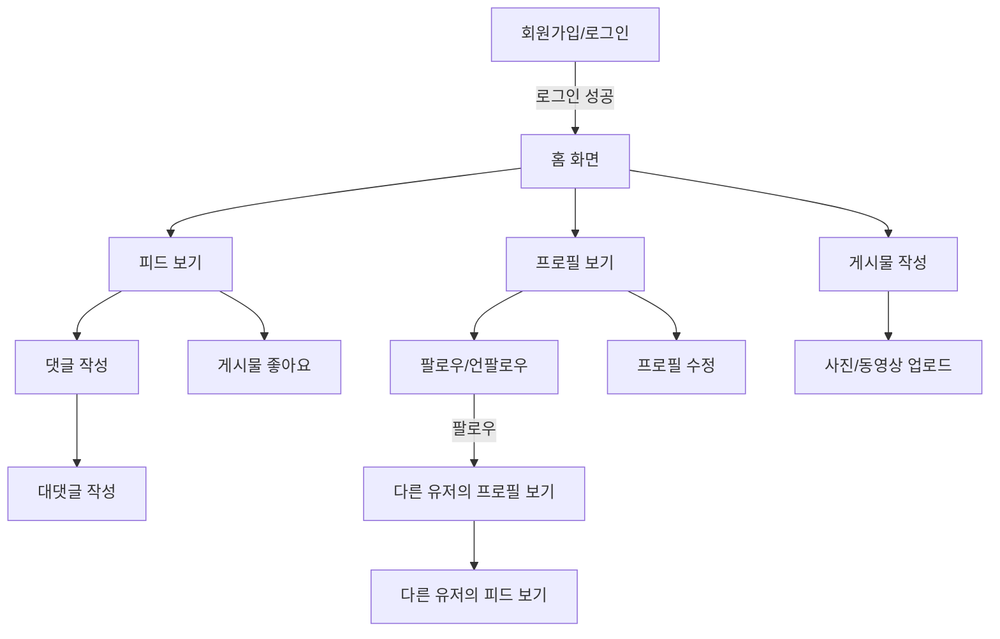

## MSA 환경 인스타그램 클론 코딩 with Spring Boot

## ✔️ 프로젝트 개요

### ⌛️ 프로젝트 기간

`2024/02` ~ `2024/05`

### ERD

### 🔧 사용 기술

#### 🌠 개발 언어 / 프레임워크

  
#### 📦 Database

#### 🧱 인프라

##### 📠 협업툴

### ⚙️ 아키텍처

### 🏄‍ Flow

## 🏃🏻 프로젝트 진행

### 📌 구현 필수 기능

- [x] 사용자 등록 / 로그인
- [x] 팔로잉 기능
- [x] 피드 등록 / 이미지 업로드 
- [x] 피드 검색
- [x] 댓글 - 대댓글

### 📌 사용 기술

### ☁️ Spring Cloud

#### 🤔 이유  
각 도메인 마다 도커 컨테이너(마이크로 서비스)를 띄우고 Spring Cloud를 통해 어플리케이션을 구축하기 위함  

#### 🖥 사용 방법
> **Spring Cloud Netflix Eureka**

Service Discovery 기능 구현
- 모든 마이크로서비스를 Eureka 서버에 등록
- 마이크로서비스를 사용하고자 하는 클라이언트 요청정보를 API Gateway로 전달
- 요청정보에 필요한 서비스의 위치정보를 반환해준다.

> **Spring API Gateway**

- 모든 마이크로서비스에 대한 요청들을 일괄적으로 처리
- 인증에 대한 처리를 필터로 구현
- discovery server로 등록된 이름으로 포워딩

> **Feign Client**

- 마이크로서비스간 통신을 위해 사용
- ex) Feed Service ↔️Image Service : 이미지 업로드 

### ✔ JWT && Redis

``JWT 사용 이유``

1. 쿠키 : 보안상 문제가 크다.
2. 세션 : 서버에 많은 부하

`` JWT 장점``  
**서버에 저장하지 않는다 -> 확장성이 높다.**

- 해당 토큰이 유효한지만 체크하면 어떤 서버로 요청을 보내도 상관이 없다.

**데이터 위변조를 막을 수 있다.**

- Header, PayLoad -> Signature 생성

``문제``  
JWT의 AccessToken만 사용하는 인증방식을 사용하게 되면 3자에게 탈취당할 경우 보안에 취약하다.

- AccessToken은 토큰이 만료될 때까지 토큰을 가지고 있는 사람은 누구나 접근이 가능하기 때문
- JWT 토큰의 유효시간을 부여!!

> JWT 토큰 유효시간

- 짧은 경우 : 자주 로그인을 해야한다. (불편)
- 긴 경우  : 토큰을 탈취당했을 때 보안에 취약

 

> Refresh Token

AccessToken의 유효시간을 짧게 하고, 긴 유효시간을 가지는 Refresh Token을 통해   
AccessToken이 만료되었다면, RefreshToken을 통해 AccessToken을 재발급한다.

 

> Redis로 JWT RefreshToken을 관리

- 레디스는 in-memory로 데이터를 관리하여 **빠른 엑세스 속도 + 휘발성** -> 캐시 용도
- 레디스는 기본적으로 **데이터의 유효시간**을 지정할 수 있다.
    - refresh token을 저장하기 적합
- refresh token의 경우 휘발성으로 삭제가 되더라도 치명적이지 않다.
    - 로그인을 다시 해야하는 정도

### ➰ GraphDB - Neo4j

인스타그램의 ``팔로워 / 팔로잉`` 기능에서의 요구사항은 아래와 같다. (추가 구현 예정)
- [ ] 나를 팔로잉한 유저의 수 / 내가 팔로잉한 유저의 수를 알려준다.
- [ ] 내가 팔로잉한 유저의 팔로워를 추천해준다.
    - 이미 팔로우되있거나 차단된 인원은 제외
    - 이때, 나와 팔로잉 되어있는 유저 몇명이 팔로우하고 있는지, 대표적인 친구를 알려준다
    - `ex) beomsic는 외 3`

#### 🤔 왜 Graph DB????
요구사항만 분석했을 때, 우리가 많이 사용하는 RDB에서도 복잡하기는 하지만 쿼리로 풀어낼 수 있다고 생각했다.  

하지만, '친구의 친구' 를 찾는 데이터의 형태는 ``관계``를 중심으로 데이터들을 조회하는 것이 더 좋다고 생각  
컬럼 기반의 참조키 형태를 가지는 RDB만으로는 한계가 있을 것이다.  

#### 💡Neo4j
Graph DB의 여러 제품중 가장 사람들이 많이 사용해 믿을만하고 레퍼런스가 충분한 Neo4j를 사용했다.

#### 🆚 RDB
RDB의 SQL 과 Neo4j의 Cypher를 통해서 쿼리의 성능을 비교해보았다.
- 친구의 수 : 1300명, 친구의 친구 : 8000명의 데이터를 통해 친구의 친구를 조회

🔥 **결과**  
SQL : 37.73 초  
Cypher : 2.27 초

 

### 💡 트랜잭션 아웃박스 패턴

댓글 정보에 저장된 유저의 정보가 업데이트 되는 경우 댓글에 담긴 유저에 대한 정보 또한 업데이트를 해주어야 한다.

이 과정에 있어서 실시간 성이 그렇게 중요하지 않다고 판단하여, 이 과정을 ``비동기적``으로 처리하면 좋겠다라고 생각했다.

🏃**시나리오**

1️⃣ 유저 정보 업데이트 (트랜잭션)

2️⃣ 유저 정보 업데이트 이벤트 발행 (이벤트가 발행되는 것이 보장되어야 한다.)

3️⃣ 이벤트를 **카프카**로 전송

4️⃣ 댓글 서비스에서 이를 받아 댓글 정보 업데이트 로직을 수행

이벤트가 도메인 로직이 수행된 이후 생성되는 것을 보장하기 위해서 ``트랜잭셔널 아웃박스 패턴``을 이용
- 유저 정보가 변경되는 로직이 수행된 후, 업데이트 이벤트가 생성되는 것을 보장

### 📒@TransactionalEventListener

🎯 **상황**

AWS S3에 이미지를 업로드하고 업로드에 성공시 이미지 관한 데이터를 DB에 저장하고 싶다.

⚠️ **DB 에 저장하는 과정에서 문제가 발생했을 때(트랜잭션이 롤백되어야 하는 상황)**  
⇒ S3 오브젝트는 서비스에서 관리할 수 없는 오브젝트가 된다.

**💡이렇게 S3 오브젝트를 서비스 레벨에서 관리할 수 있도록 하고 싶다.**   

#### 🆚@EventListener

`@EventListener` 를 사용하면 Event를 PublishEvent() 메서드가 호출되는 시점에 바로 이벤트를 처리한다.

하지만, S3에 이미지를 업로드에 성공 한 후, 이미지 정보를 DB에 저장하는 트랜잭션이 실패했을 경우 S3에 업로드한 이미지를 삭제하는 이벤트를 처리하고 싶기 때문에 `@TransactionEventListener` 를 사용해야 한다.

@TransactionEventListener은 `TransactionPhase` 값(트랜잭션 작업 처리 상태)에 따라 이벤트를 언제 처리할 것인지 지정할 수 있다.

🙂 **`TransactionPhase.ROLLBACK`을 통해 트랜잭션이 Rollback 된 이후에 S3 이미지 삭제 이벤트를 통해 요구사항을 만족하고자 한다.**  

> 🧑🏻‍💻구현

**🏃 동작 하는 과정**
1. 사용자가 이미지 업로드 요청을 피드 서비스에 보낸다.
2. 피드 서비스에서는 DB 저장와 S3 업로드를 하나의 생명주기(`Transaction`)로 처리한다.
3. **FeignClient**를 이용해 S3 업로드 서비스와 통신하여 S3 업로드 서버에 이미지에 대한 정보를 보낸다.
    - S3 업로드 서버에서는 S3에 이미지를 업로드한다.
    - 업로드 후 저장된 S3 오브젝트에 대한 정보를 리턴해준다.
4. **업로드 성공시**
    - 트랜잭션이 롤백되는 상황을 가정하여 S3에 업로드된 파일을 삭제하는 이벤트을 만들어야 한다.
    - DB에 이미지 관련 정보를 저장한다. (이미지 url, 이미지 name, 저장 날짜 등)
        - 💣 **저장에 실패하는 경우(예외 발생)**
            - 트랜잭션이 rollback되어 @TransactionEventListener로 설정한 메소드가 실행
            - 이 메소드에서 Rollback되는 이미지의 정보를 통해 `Kafka`로 메시지를 발행한다.
            - 이미지 서비스에서 rollback 이미지에 대한 정보를 consume하여 삭제 로직을 처리(비동기)

5. **업로드 실패시**
    - DB 저장은 업로드 로직이 실행되고 난 후 실행되기 때문에 아무런 처리를 하지 않고 해당 생명주기를 끝내면 된다.

> **💡`카프카`를 이용해서 이미지 삭제를 처리한 이유**
>
> - 이미지 삭제에 대한 로직은 동기적으로 처리할 필요가 없다고 생각
> - 실시간이 아니더라도 삭제만 되면 되기 때문에 카프카를 통해 비동기적으로 처리하는 것이 맞다고 생각
>
> 💥**이미지 생성은 카프카를 사용하지 않은 이유?**
>
> - 게시물을 생성하는데 이미지에 대한 정보가 필요하기 때문에 이는 동기적으로 처리했다.

